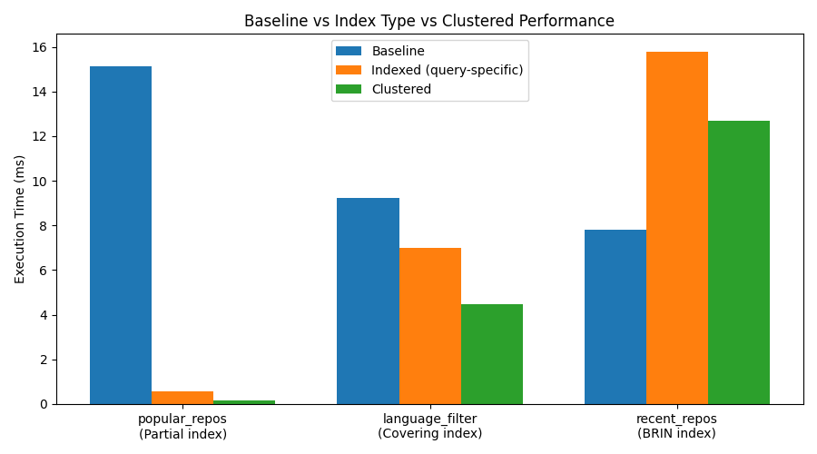

# Database Indexing and Clustering Study

## Overview
This project evaluates the performance impact of realistic PostgreSQL indexing and physical clustering strategies using a ~100,000-row dataset collected from the GitHub Repository Search API. The goal is to measure **when indexing helps, when it provides marginal benefit, and when physical clustering actively hurts performance**, using controlled baseline, indexed, and clustered experiments.

---

## Dataset
- **Source:** GitHub Repository Search API  
- **Size:** ~100,000 repositories  
- **Schema:**  
  `id, name, full_name, stargazers_count, forks_count, language, created_at, updated_at`  
- **Deduplication:** Global primary key (`id`)  
- **Storage:** PostgreSQL (single-node)

---

## Queries Evaluated
1. **Popular repositories**  
   Repositories with ≥ 5000 stars, ordered by star count  
2. **Language filter**  
   All repositories where `language = 'Python'`  
3. **Recent repositories**  
   Count of repositories created between `2023-01-01` and `2023-02-01`

---

## Indexing Strategies
- **Partial B-tree index** on `stargazers_count` for popular repositories  
- **Covering B-tree index** on `language` with included columns  
- **BRIN index** on `created_at`  
- **Physical clustering** using `CLUSTER` on the covering index  

---

## Methodology
- **Baseline:** Primary key index only  
- **Indexed:** Secondary indexes added  
- **Clustered:** Table physically reordered using `CLUSTER`  
- **Measurement:** `EXPLAIN (ANALYZE, FORMAT JSON)`  
- **Metric:** Execution time (milliseconds) and execution plan type  

---

## Results Summary

### Baseline vs Indexed (No Clustering)

| Query | Baseline (ms) | Indexed (ms) | Speedup | Plan Change |
|-----|--------------|--------------|---------|------------|
| Popular repos | 10.69 | 0.10 | **106.9×** | Seq Scan → Index Scan |
| Language filter | 7.45 | 7.07 | **1.05×** | Seq Scan → Bitmap Heap Scan |
| Recent repos (date range) | 5.93 | 1.34 | **4.44×** | Seq Scan → Aggregate |

---

### Indexed vs Clustered

| Query | Indexed (ms) | Clustered (ms) | Speedup from Clustering |
|-----|--------------|----------------|-------------------------|
| Popular repos | 0.10 | 0.13 | **0.77× (slower)** |
| Language filter | 7.07 | 4.26 | **1.66×** |
| Recent repos (date range) | 1.34 | 10.33 | **0.13× (much slower)** |

---

---

## Key Findings

### 1. Partial indexes can deliver extreme speedups for selective queries
The partial index on high-star repositories reduced execution time by over **100×** because it restricted the index to a small, frequently accessed subset of rows, drastically reducing both index height and the number of tuples scanned. For the popular-repository query, PostgreSQL was able to traverse a compact index and retrieve only a handful of qualifying tuples, avoiding a full table scan and minimizing heap access.

### 2. Indexing low-selectivity queries yields diminishing returns
The covering index on the language column produced only a **~5% improvement** because the predicate was low-selectivity, matching a large fraction of the table. Although the covering index enabled an index-only scan and eliminated heap access, PostgreSQL still had to scan most of the index entries to satisfy the query. In this case, the cost of traversing a large portion of the index and performing visibility checks offset the benefits of avoiding heap reads, resulting in performance comparable to a sequential scan.

### 3. BRIN indexing helped moderate-range date queries
The date-range query improved by **4.4×** after indexing because the BRIN index allowed PostgreSQL to skip large regions of the table that fell entirely outside the requested time window. The BRIN index stores summary metadata (min/max values) per block range, enabling the planner to eliminate entire block ranges without scanning individual rows.

### 4. Physical clustering is highly workload-dependent
Clustering produced **mixed results**:
- Improved the language filter query by **1.66×** due to better physical locality
- Slightly **degraded** the already-fast popular repository query
- **Severely degraded** the date-range aggregation query (≈8× slower)

This demonstrates that clustering can **actively harm performance** when the physical order conflicts with access patterns or aggregation behavior.

---

## Conclusion
This study shows that database performance tuning is fundamentally **workload-specific**. While partial indexing provided dramatic improvements for highly selective queries, clustering introduced significant tradeoffs and, in some cases, severe regressions. These results emphasize that physical layout optimizations must be applied selectively and validated empirically rather than assumed beneficial.
